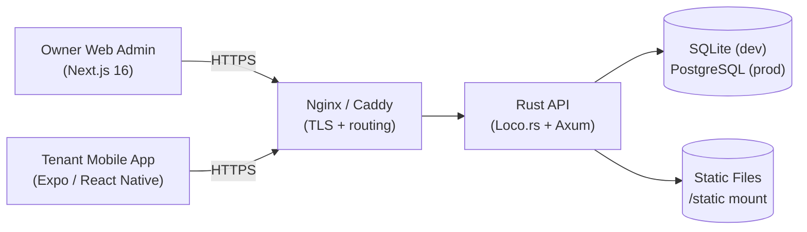

# Architecture

Last updated: April 9, 2026
Owner: Bao Dinh
Status: In Progress
Type: Diagram
Version: v2.0

### Architecture (High-level) — MVP Only

<aside>
🏛️

This document describes the **high-level architecture for MVP Only**, aligned with the SDD.

It focuses on components, boundaries, data ownership, key flows, security posture, and deployment shape.

</aside>

### A0) MVP scope (what this architecture covers)

**Roles:** Owner, Tenant

**MVP domains:**

- Account: registration, login/logout, RBAC
- Property: buildings/floors/rooms
- Pricing: service catalog + effective-dated room pricing
- Contracts: 1 active contract per room
- OCR: capture photo → OCR → validate vs previous → manual correction/override
- Billing: invoice generation + status workflow + tenant invoice view
- Platform/Security: audit events, JWT, data privacy

---

### A1) Architecture goals and constraints

- **Deterministic billing:** pricing and reading rules produce a single correct invoice result.
- **Evidence-first:** meter photos are stored and referenced from readings and invoices.
- **Strict isolation:** tenant data is isolated to own contract/invoices; owners can access only owned resources.
- **Idempotency:** invoice generation and asynchronous callbacks are safe to retry.
- **MVP simplicity:** minimal services; clear boundaries in code even when deployed as one app.

---

### A2) System context (C4 — Level 1)

**Actors**

- **Owner:** manages property, prices, contracts, readings, invoices.
- **Tenant:** views invoices and meter evidence.

**External systems (MVP)**

- **Object storage** (S3-compatible or cloud storage) for photos/documents.

---

### A3) Containers / major components (C4 — Level 2)

1. **Owner Web Admin (Client) — Next.js 16 + React 19**
   - Create/manage buildings, floors, rooms, services
   - Configure room services and price rules
   - Manage contracts and tenants
   - Capture meter photos (upload), submit and manage meter requests
   - Configure meter settings (meter_request_configs)
   - Generate and manage invoices (create, void, mark paid)
   - View room-services dashboard
2. **Tenant Mobile App (Expo 55 / React Native 0.83) — NativeWind + TanStack Query**
   - View meter submission status
   - Submit meter reading requests
   - View meter history
3. **API Server (Rust + Loco.rs 0.16 + Axum 0.8) — Core backend**
   - Single REST API backend, structured as modular controllers/models/views
   - Enforces JWT-based auth and resource ownership
   - Manages invoice lifecycle (create, calculate, void, pay, webhook)
   - Manages meter request workflow (owner approves/rejects tenant submissions)
   - Serves static files for uploaded images
   - Database ORM: SeaORM 1.1
4. **Data stores**
   - **SQLite** (development) / **PostgreSQL** (production)
   - No Redis — background jobs via Loco.rs task system
5. **Reverse proxy (Nginx / Caddy)**
   - TLS termination
   - Routing
   - Basic rate limiting

---

### A4) Key architectural boundaries (aligned to SDD modules)

- **Auth/RBAC boundary:** token validation, role checks, ownership checks.
- **Property boundary:** buildings/floors/rooms and room status.
- **Pricing boundary:** service catalog + price rules (effective dating, no overlap).
- **Meter/OCR boundary:** capture, jobs, result validation, manual correction.
- **Billing boundary:** invoice generation, line items, state machine, tenant invoice query.
- **Audit boundary:** append-only audit event sink + export.

---

### A5) Data ownership and consistency rules

- PostgreSQL is the **system of record**.
- Derived states:
  - `room.status` is derived from contract lifecycle (with Maintenance override).
  - invoice totals are derived from readings + pricing.

**Hard consistency rules (MVP)**

- Only 1 ACTIVE contract per room.
- No overlapping price rule effective ranges for the same `(room, service)`.
- Unique invoice per `(contract, period)`.

---

### A6) Main flows (high-level)

#### A6.1 Capture → OCR → validate → finalize reading

1. Owner uploads meter photo for room + period.
2. API stores image in object storage and creates reading `DRAFT`.
3. API enqueues OCR job (Redis queue) and calls OCR service.
4. OCR service returns `{ value, confidence }`.
5. API validates numeric:
   - invalid → `NEEDS_REVIEW`
   - valid → `RECOGNIZED`
6. API compares against previous finalized reading:
   - decreased → `NEEDS_REVIEW`
   - otherwise ready to finalize
7. Owner can manually correct and finalize → `FINALIZED`.

#### A6.2 Effective-dated pricing (no overlap)

1. Owner sets a new unit price for Room + Service with effective start date.
2. API prevents overlaps.
3. API auto-closes previous rule by setting effective_end.

#### A6.3 Generate invoices (idempotent batch)

1. Owner triggers invoice generation for a period.
2. API iterates active contracts and creates invoice if not exists.
3. API computes line items:
   - rent
   - electricity/water from reading deltas
   - services from effective price rules
4. Missing reading or invalid sequence → invoice `PENDING_CONFIRMATION`.
5. Otherwise invoice `UNPAID`.

#### A6.4 Tenant views invoices (strict isolation)

1. Tenant requests invoice list.
2. API resolves tenant contracts.
3. API returns invoices for those contracts only.
4. Meter photo URLs are signed and short-lived.

---

### A7) Security and privacy architecture (MVP)

- **TLS 1.2+** at Nginx.
- **JWT access token** (short TTL) + refresh token.
- **RBAC:** role claim in token + server-side ownership checks.
- **Signed URLs** for meter photos and tenant documents (expire ≤ 15 minutes).
- **Safe errors:** forbidden access returns 403 without leaking resource existence details.

---

### A8) Observability and audit

- Application logs include request id and user id (if authenticated).
- **Audit events (append-only)** for:
  - login success/failure
  - reading override/correction
  - invoice create/void/status change
  - contract create/end

---

### A9) Deployment view (MVP)

**Option A (simplest):**

- 1 VM (or 1 container host)
  - Nginx
  - NestJS API (Docker)
  - OCR service (Docker)
  - PostgreSQL (managed or container)
  - Redis (container)

**Option B (managed data):**

- App containers + managed Postgres + managed Redis

---

### A10) Architecture diagram (Mermaid)

---

### A11) Key architectural decisions (actual implementation)

- **Rust + Loco.rs + Axum:** chosen over NestJS for performance, safety, and learning goals. Loco provides Rails-like conventions (MVC, migrations, tasks) in Rust.
- **SeaORM:** async ORM for SQLite (dev) and PostgreSQL (prod). Migration-first database management.
- **No separate OCR service:** OCR functionality scoped out of MVP backend; meter reading workflow relies on owner manual input + photo upload.
- **Meter request workflow:** Tenant mobile app submits readings; owner reviews/approves/rejects via dashboard.
- **Effective-dated pricing via room_services + price_rules:** `room_services` links rooms to services, `price_rules` manages per-room pricing with effective dating.
- **Invoice lifecycle:** UNPAID → PAID (via pay or webhook) | UNPAID → VOIDED. `calculate` endpoint pre-computes amounts before creation.
- **i18n (multi-language):** Web uses `next-intl`; Mobile uses `i18next` + `react-i18next`. Shared translations in `packages/translations`.
- **Monorepo (Turborepo + pnpm):** `apps/api`, `apps/web`, `apps/mobile`, `packages/shared`, `packages/translations`.
